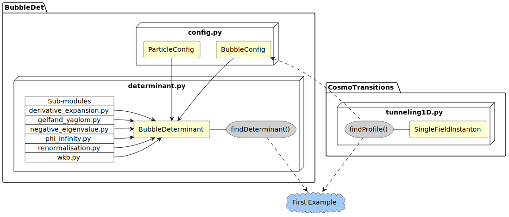

======================================
First example
======================================

As a first example use case for BubbleDet, let us consider a simple real scalar
model in 3d. A code to compute the nucleation rate for this model is included in
`examples/first_example.py`.

To start, we import the relevant libraries, and define the model by a tree-level
potential. We also define the first and second derivatives of the potential.

.. literalinclude:: ../../examples/first_example.py
   :language: py
   :lines: 8-36

For the values of the parameters we have chosen, the potential has a false
(metastable) minimum at :py:data:`phi_false`, and a true (stable) vacuum at
:py:data:`phi_true.`

We then use CosmoTransitions to solve for the bubble, or bounce, profile. We
also compute the tree-level action evaluated on the bubble.

.. literalinclude:: ../../examples/first_example.py
  :language: py
  :lines: 39-53

This profile can then be passed to BubbleDet to compute the functional
determinant of scalar field fluctuations in the background of the bubble.

.. literalinclude:: ../../examples/first_example.py
  :language: py
  :lines: 55-67

The variable :py:data:`S1` stores the one-loop correction to the tree-level
action :py:data:`S0`, and :py:data:`S1_err` gives an estimate for the numerical
error in :py:data:`S1`.

Here is a component diagram showing how the different classes and packages
interacted in this first example.

|
